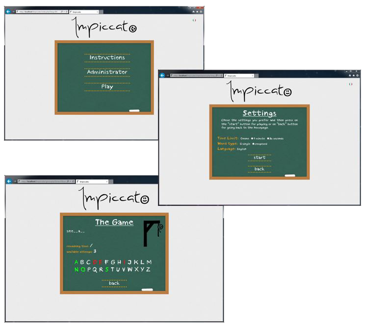

# Impiccato
A web version of the hangman game

## Description
Hangman is a paper and pencil guessing game for two or more players. One player (COMPUTER) thinks of a word, phrase or sentence and the other (YOU) tries to guess it by suggesting letters or numbers, within a certain number of guesses.

## Screenshoots

## Features
 * Multilanguage (IT, EN)
 * Choice between words/phrases
 * Timer ON/OFF
 * Support for the administrator (update database)
 
## Technologies
 * HTML 4.1
 * JavaScript
 * PHP
 * CSS